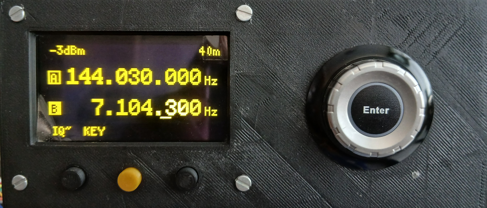
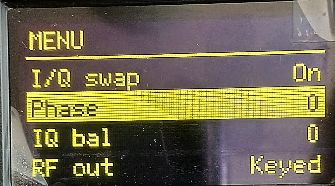
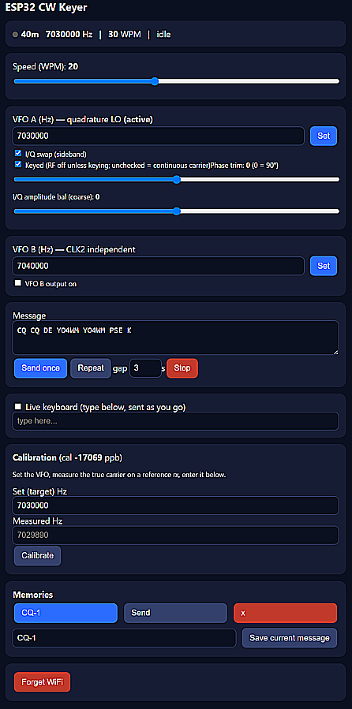

<h1 align="center">📻 ESP32‑S3 HF VFO + CW Keyer</h1>

<p align="center">
  <em>A WiFi‑controlled HF signal source, quadrature LO and CW keyer for the ham bench.</em>
</p>

<p align="center">
  
  
  
  
  
</p>

---

A bench **VFO / signal generator + iambic CW keyer** for HF SDR test, tuning and
alignment, built on an **ESP32‑S3‑DevKitC‑1 (WROOM‑2)** driving a **Si5351A**
clock generator and an **SSD1306** OLED. It doubles as a **quadrature (I/Q) local
oscillator** for tuning Tayloe / quadrature‑sampling (QSD) mixers, and includes a
full CW keyer controllable both from a paddle and from any browser over WiFi.

> Designed and built by **YO4WM**, with development help and guidance from
> **[Claude Code](https://www.anthropic.com/claude-code)** (Anthropic).

---

## 📷 Gallery

<!--
  To add pictures: create a `docs/` folder, drop the images in, then uncomment
  the table below (rename files to match). Easiest of all: open this README on
  GitHub, click the pencil (Edit), and drag‑and‑drop images straight into it —
  GitHub uploads and inserts the links for you.-->

| The instrument | OLED dual‑VFO | Web control page |
|:---:|:---:|:---:|
|  |  |  |


---

## Features

### Signal generation (Si5351A)
- **VFO A** on `CLK0`, tunable ~8 kHz – 160 MHz.
- **Quadrature I/Q LO** — `CLK0` (0°) + `CLK1` (90°) on the same PLL for driving a
  Tayloe/QSD front end. Valid ≥ ~4.72 MHz (40 m and up); below that it
  automatically falls back to a single output.
  - **Phase trim** — fine adjust around 90° for I/Q image nulling.
  - **I/Q swap** — flips the +90° between channels to select the opposite
    sideband / correct a reversed image.
  - **I/Q amplitude balance** (coarse) — offsets `CLK1` drive vs `CLK0`.
- **VFO B** on `CLK2` — an *independent* second frequency (second tone for IMD
  testing, a marker, or a BFO).
- **Per‑output drive** (2 / 4 / 6 / 8 mA, shown as approx. dBm on the display).
- **RF‑out mode** — *Carrier* (continuous, for alignment) or *Keyed* (RF only
  while keying, like a transmitter).
- **Reference calibration** in ppb, computed from a measured‑vs‑set frequency, so
  `CLK0` can be zero‑beat against a known reference.

### CW keyer
- **Iambic A / Iambic B / Straight‑key** modes.
- Adjustable **speed 5–40 WPM** (decodes cleanly to 30+ WPM on an SDR).
- Paddle inputs plus a **key‑line output** (to drive PTT / QSK).
- **Text‑to‑CW auto‑sender** shared with the paddle (a live paddle touch aborts
  an auto message).

### WiFi control page (WebSocket)
- **Live keyboard** — type and it's sent as CW as you go.
- **Message memories** — stored in the browser, sent once or repeated with a gap.
- **WPM, frequency, VFO B, quadrature, calibration** — all controllable live.
- **WiFi provisioning** — first boot brings up a `VFO-Keyer` SoftAP with a setup
  form; enter your network and it reboots as a station. A wrong/lost password
  can't lock you out (it reboots back into setup).
- **mDNS** — reachable at **`http://vfo-keyer.local/`** once on your LAN.

### OLED UI
- **Dual‑VFO display** — both A and B, right‑aligned, tagged, with a **tuning
  cursor** underlining the active digit and a **band label derived from the
  actual frequency**.
- **Settings menu** — WPM, keyer mode, drive, calibration, VFO B, I/Q swap,
  phase, I/Q balance, RF‑out mode, OLED contrast.
- **Power‑on splash** with antenna art, callsign and revision.
- All settings **persist to flash (NVS)** and are restored on power‑up
  (including per‑band last frequency).

---

## Hardware

| Part | Role |
|------|------|
| ESP32‑S3‑DevKitC‑1 (WROOM‑2, Octal flash/PSRAM) | Controller |
| Si5351A breakout (25 MHz TCXO/xtal) | VFO / clock generator |
| SSD1306 128×64 OLED (3‑wire SPI) | Display |
| Rotary encoder + push | Tuning / menu |
| 3 push buttons | Band / Step / Mode |
| CW paddle (or straight key) | Keyer input |

### Block diagram

```
              ┌───────────────────────────────┐
   Encoder ──▶│                               │──I2C──▶ Si5351A ──┬─ CLK0 ── I  (VFO A, 0°)
   Buttons ──▶│                               │                   ├─ CLK1 ── Q  (VFO A, 90°)
    Paddle ──▶│      ESP32‑S3 (WROOM‑2)        │                   └─ CLK2 ──── VFO B (indep.)
             │   VFO · keyer · web · menu     │
             │                               │──SPI──▶ SSD1306 OLED (128×64)
     WiFi ◀─▶│                               │──GPIO─▶ Key line out (PTT / QSK)
   browser   └───────────────────────────────┘
     ▲
     └── http://vfo-keyer.local/  (WebSocket control page)
```

### Pin map (`main/bsp_pins.h`)

| Function | GPIO |
|----------|------|
| OLED SCLK / MOSI / CS / RST | 12 / 11 / 10 / 8 |
| I2C SDA / SCL (Si5351) | 4 / 5 |
| Encoder A / B / Push | 6 / 7 / 15 |
| Buttons Band / Step / Mode | 16 / 17 / 18 |
| Paddle DIT / DAH | 1 / 2 |
| Key‑line out | 21 |

> GPIO 26–37 are used by the Octal flash/PSRAM and are avoided, along with the
> strapping/USB/UART pins. Change assignments in `bsp_pins.h` to match your wiring.

---

## Front‑panel controls

| Control | Action |
|---------|--------|
| **Encoder rotate** | Tune the selected VFO (or adjust a value in the menu) |
| **Encoder push** | Open the settings menu (short); in menu: enter/confirm |
| **Mode button** | Select VFO **A ↔ B** (menu closed); **Back/Exit** (menu open) |
| **Step button** | Cycle the tuning step (1 Hz … 1 MHz) |
| **Band button** | Cycle amateur bands (per‑band memory on VFO A) |
| **Paddle** | Send CW; aborts an auto‑sent message |

The selected VFO's tag is filled and shows the digit‑cursor underline.

---

## Build & flash

Requires **ESP‑IDF v5.x** (developed on v5.4.2).

```bash
# one‑time: install/export ESP‑IDF, then in the project folder:
idf.py set-target esp32s3
idf.py build
idf.py -p <PORT> flash monitor
```

The first build fetches managed components (`u8g2`, `mdns`) into
`managed_components/` — **internet is required once**.

### First‑run WiFi setup
1. Join the open **`VFO-Keyer`** WiFi network from a phone/laptop.
2. Browse to **`http://192.168.4.1/`**, enter your SSID/password, save.
3. The device reboots and joins your network; the serial log prints its IP, and
   it's also reachable at **`http://vfo-keyer.local/`**.
4. To re‑provision later: **Forget WiFi** on the control page.

### Calibration
Set the VFO to a known frequency, measure the true carrier on a reference
receiver/counter, and enter both values in the web **Calibration** panel. The ppb
correction is computed, applied and saved.

---

## Project layout

```
main/
  hello_world_main.c   app: VFO state, buttons, NVS persistence, glue
  si5351.c/.h          Si5351A driver (freq, drive, correction, quadrature)
  display.c/.h         SSD1306 3‑wire SPI + VFO/menu/splash rendering (u8g2)
  input.c/.h           encoder (PCNT) + debounced buttons/paddle
  keyer.c/.h           iambic A/B / straight‑key keyer task
  morse.c/.h           text → CW auto‑sender task
  menu.c/.h            generic OLED settings menu
  websrv.c/.h          WiFi provisioning + HTTP/WebSocket control page + mDNS
  bsp_pins.h           board pin map
```

---

## Notes & limitations
- Quadrature (0/90°) works on ~40 m and up; on 80/160 m the Si5351 phase register
  can't reach 90°, so VFO A drops to a single output there.
- The Si5351 outputs are **square waves** — expect odd harmonics; add a low‑pass
  filter for a spectrally clean source. Amplitude I/Q balance is coarse (only 4
  hardware drive levels).
- Two independent frequencies (A on PLLA, B on PLLB) are fully supported; three
  fully independent outputs would require sharing a PLL with fractional dividers.

---

## How it was built

This project was developed iteratively at the bench, one working feature at a
time, with **[Claude Code](https://www.anthropic.com/claude-code)** as a pair‑
programming partner — bring‑up and debugging (OLED 3‑wire SPI, Si5351 setup),
then the encoder, keyer, WiFi/WebSocket control page, dual‑VFO + quadrature LO,
the OLED menu, calibration, and all the UI polish. Every step was tested on real
hardware before moving on, and the firmware is a small, readable ESP‑IDF C
codebase (no Arduino layer).

If you build one, improve it, or spot a bug — issues and PRs are welcome.

Here is a **[short video](https://www.youtube.com/shorts/FScfBk7vbhs)** on it and its messy wirring :-).

**73 de YO4WM** 📡

## Credits
- Firmware & hardware: **YO4WM**
- Development guidance: **Claude Code** (Anthropic)
- Libraries: [u8g2](https://github.com/olikraus/u8g2) (via the `nixy4/u8g2`
  ESP‑IDF port), Espressif **ESP‑IDF** and its `mdns` component

## License
MIT — see [`LICENSE`](LICENSE).

